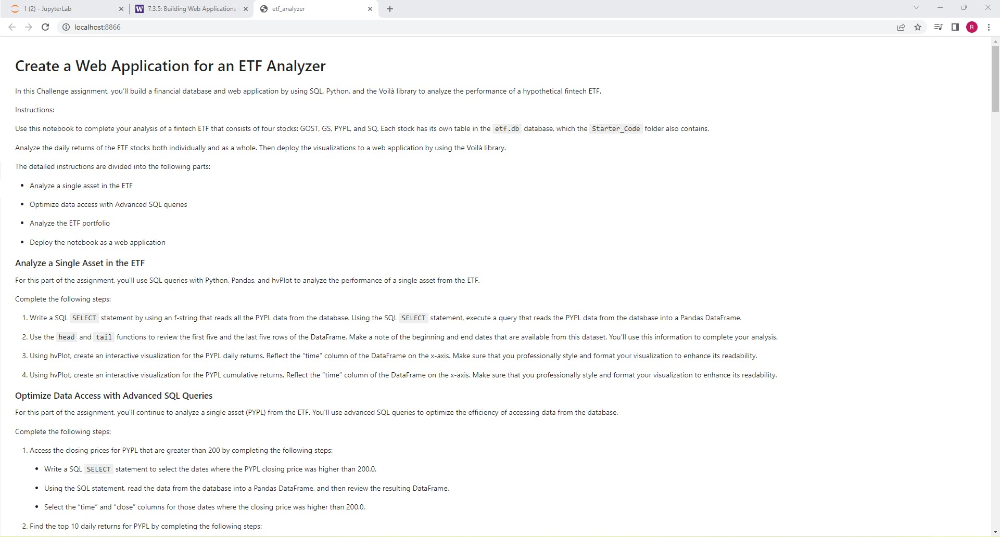
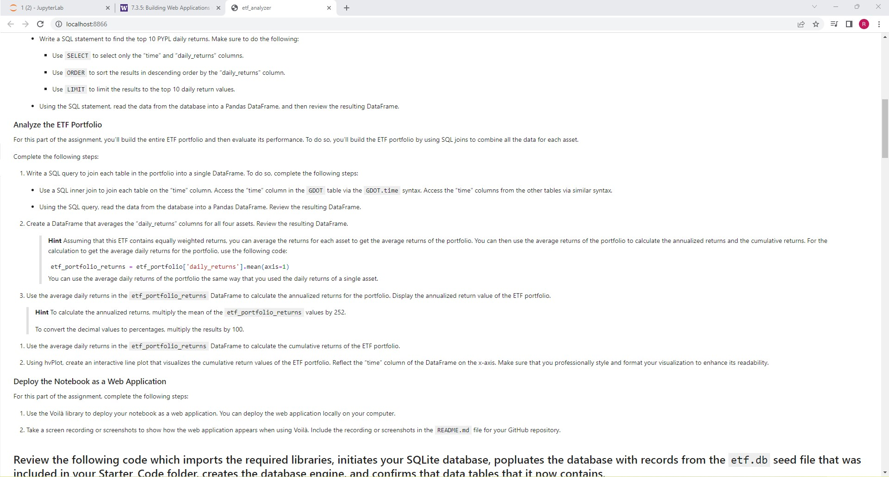
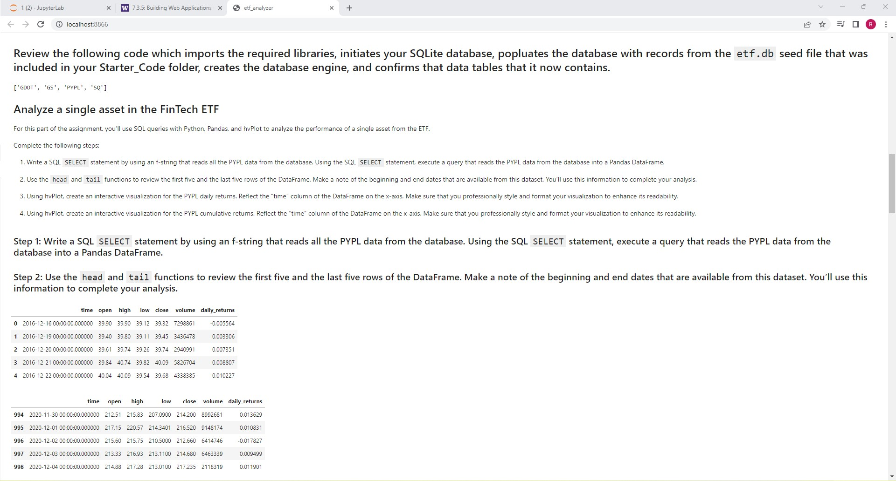
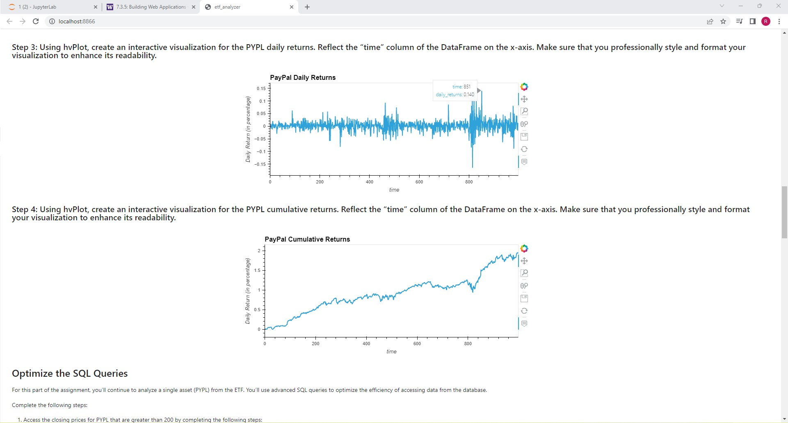
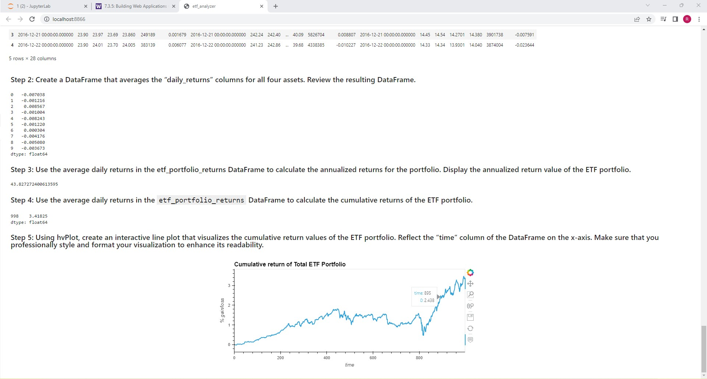

# module_7

This project is a financial database and web application to analyze the performance of a hypothetical fintech ETF

## Technologies, Imports and Dependencies 

SQL, Python, hvplot and the Voilà library

## Usage

## Contributors

Ryan Svendson
rsvensdon@gmail.com

